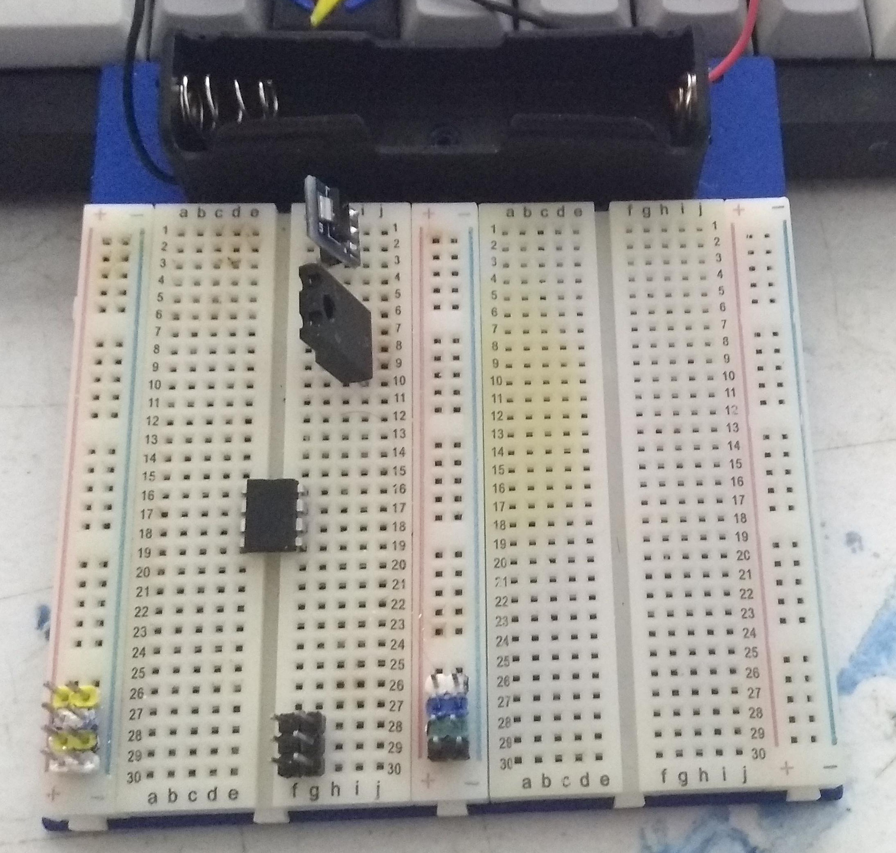
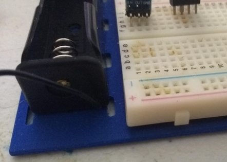

Backing plate to rig up a "half" sized solderless board.

Wait - half of what ?  They come in so many shapes and sizes !  Well, *my* "full size" ones are [1560 points](SBB_1560_Full.jpg).  I also have a bunch of "1/4 size" [400-point](SBB_400_Quarter.jpg) ones, so i figured i'd link a couple together, making a "1/2 size" 750 point option.

The double-sided tape holds those together well enough, but after linking them together things were a bit floppy.  Great time to take advantage of the 3D printer !

---

There are holes that could be used for 9v battery clips, and slots sized and spaced to zip-tie on an 18650 battery holder.

---

PS, SharpSCAD is still a very young side-project, there will be lots of churn before i make that repo public.  (As you can see, no support for variables or "real" modules can make for some inefficent output...)