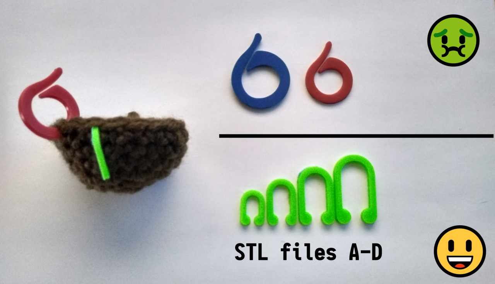
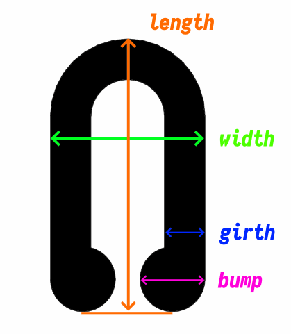

## A configurable, compact stitch marker for crochet, knitting, etc.

The stitch markers i've used in the past can get in the way a bit when working with small items, so i cooked up an alternative.

Easily tweaked with [OpenSCAD](https://www.openscad.org/downloads.html) but i've included a few STL files for convenience:

|     | Length | Width | Bump  | Girth | Height |
| --- | :----: | :---: | :---: | :---: | :----: |
| A   |   12   |   8   |  3.2  |  1.6  |  1.6   |
| B   |   16   |  10   |  3.6  |  1.8  |  1.6   |
| C   |   20   |  12   |  4.2  |  2.0  |  2.0   |
| D   |   24   |  14   |  5.0  |  2.0  |  2.0   |

